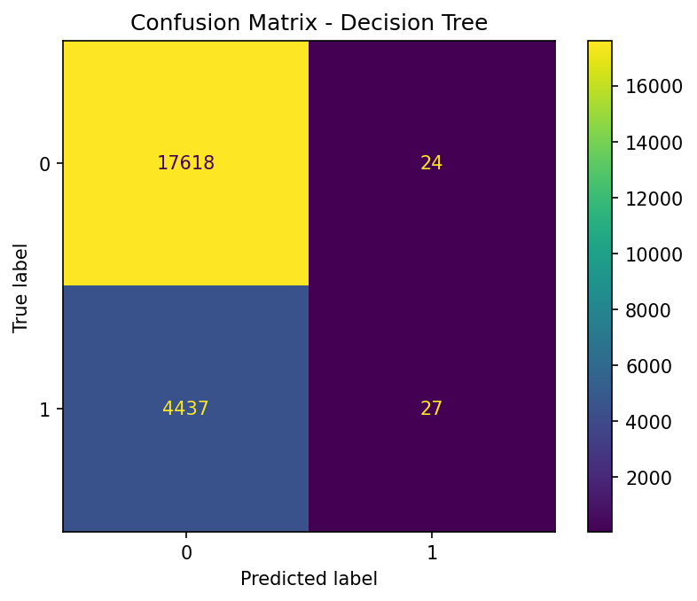

# Clinical Appointment No-Show Prediction & Agentic AI Care Assistant

This project is a Capstone implementation that transitions a traditional machine learning pipeline into a generative, agent-based healthcare coordination assistant. 

The goal is to not only predict if a patient will miss an appointment, but to autonomously generate actionable, operational guidelines using a Large Language Model (LLM) constrained by Retrieval-Augmented Generation (RAG).

**Deployed App:** [https://medicalappointmentnoshows.streamlit.app/](https://medicalappointmentnoshows.streamlit.app/)

---

## 🔍 System Architecture Overview

The system bridges predictive analytics with an autonomous decision-support system:
1. **Predictive Layer:** Supervised ML model determines probabilistic risk.
2. **State Management:** LangGraph orchestrates the reasoning workflow.
3. **Retrieval Layer:** Local FAISS vectorstore grounds the LLM in real protocols.
4. **Agentic Layer:** Groq Fast API processes patient data and guidelines to output a structured care report.

---

## ⚙️ Phase 1: Predictive Modeling (Milestone 1)

The foundation is built on the Kaggle *Medical Appointment No-Shows* dataset.

**Preprocessing & ML:**
- Frame the problem as a **binary classification** task.
- Target Variable: `No-show` (`1` = Missed, `0` = Attended).
- Engineered the feature `WaitingDays` to capture the friction between scheduling and appointment.
- Addressed severe class imbalance (80% attend, 20% no-show) by implementing **SMOTE** (Synthetic Minority Over-sampling Technique) in the final pipeline.

The model outputs a deterministic risk probability and assigns a category: **Low Risk, Medium Risk, or High Risk**.

---

## 🤖 Phase 2: Agentic Workflow & RAG (Milestone 2)

Based on the predicted risk, the application hands the execution over to an autonomous AI agent framework.

### 1. LangGraph State Machine
We utilize a stateful directed graph defining strict operational nodes:
- `retrieve_guidelines`: Extracts semantic context representing the patient's risk profile.
- `clinical_reasoning`: Groq LLM synthesizes patient demographics alongside retrieved guidelines.
- `generate_report`: Formats the LLM output into strict structural reports.

### 2. Local FAISS Vectorstore (RAG)
To prevent the LLM from hallucinating clinical interventions, the app embeds a static `guidelines.txt` using the HuggingFace `all-MiniLM-L6-v2` embedding model. 
When the agent executes, it uses **k-NN similarity search ($k=2$)** inside the local FAISS index to supply exact operational guidelines to the LLM context window.

### 3. Generative AI via Groq
The `llama-3.1-8b-instant` model hosted on Groq acts as the reasoning engine for the system, tasked with delivering a structured:
- **Risk Summary**
- **Intervention Protocol**

---

## 🚀 Setup & Installation

If you wish to run the project locally, duplicate this repository and install dependencies:

```bash
git clone https://github.com/TathagatHarsh/medical_appointment_no_shows.git
cd medical_appointment_no_shows
pip install -r requirements.txt
```

### Environment Variables
For the Agent to work, you must connect it to Groq:
1. Obtain a Free Tier API Key from [Groq Console](https://console.groq.com/).
2. Create a `.env` file in the root directory.
3. Add the following entry:
```env
GROQ_API_KEY=gsk_your_api_key_here
```

### Running the App
```bash
streamlit run app.py
```

---

## 📸 Technical Screenshots

### Agent Output Example
*(Predictive scoring followed by generative RAG analysis)*

**(See Streamlit deployment for live visual demos!)**

### Legacy Visuals: Target Variable Imbalance
*(Logistic Regression & Decision Tree models were originally built upon unbalanced datasets prior to SMOTE integration)*



